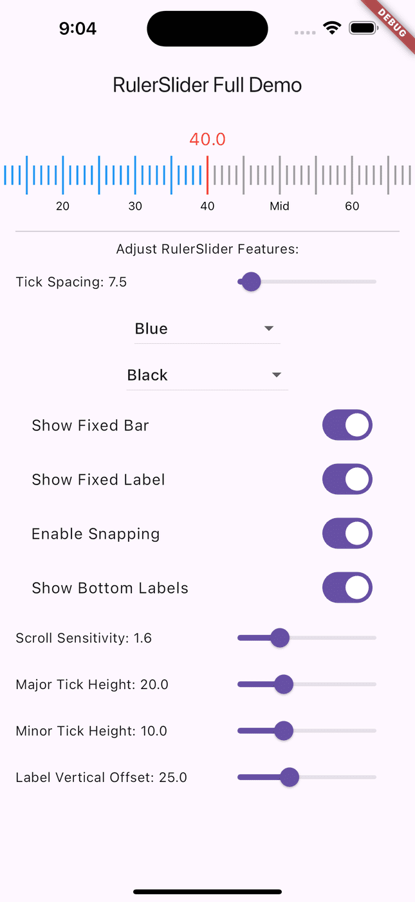
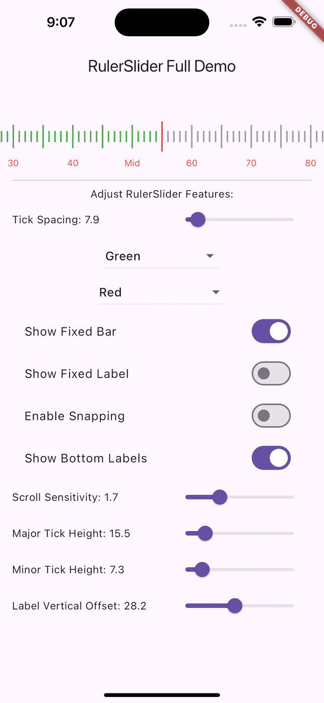
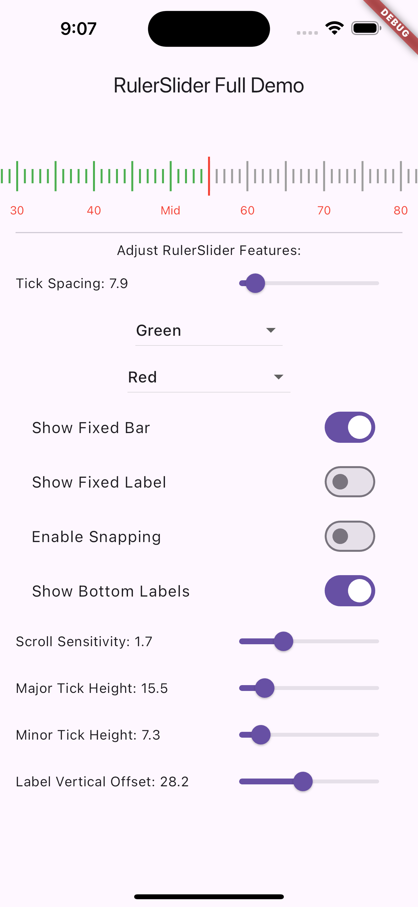

# Ruler Slider Plugin for Flutter

This package provides a highly customizable horizontal ruler slider for Flutter. It allows users to scroll through a ruler-like interface and select values, with options for custom tick marks, labels, snapping behavior, and more.

## Features

- Customizable tick marks (color, size, and spacing).
- Optional snapping behavior for precise value selection.
- Custom labels for specific tick intervals.
- Adjustable appearance of the ruler, tick marks, labels, and fixed bars.
- Callback function that returns the selected value.

## Screenshots

Here are some screenshots showcasing the RulerSlider in action:

   


## Parameters

- **`minValue`**: (double) Minimum value of the slider.
- **`maxValue`**: (double) Maximum value of the slider.
- **`initialValue`**: (double) Initial value of the slider, default is the midpoint of `minValue` and `maxValue`.
- **`rulerWidth`**: (double) Width of the ruler widget.
- **`rulerHeight`**: (double) Height of the ruler widget.
- **`selectedBarColor`**: (Color) Color of the selected tick marks.
- **`unselectedBarColor`**: (Color) Color of unselected tick marks.
- **`tickSpacing`**: (double) Space between each tick on the ruler.
- **`valueTextStyle`**: (TextStyle) Style for the label that shows the current value.
- **`customLabels`**: (List<String>?) Optional custom labels for specific tick intervals.
- **`onChanged`**: (ValueChanged<double>?) Callback that returns the selected value.
- **`showFixedBar`**: (bool) Whether to display a fixed center bar for current value indication.
- **`fixedBarColor`**: (Color) Color of the fixed bar.
- **`fixedBarWidth`**: (double) Width of the fixed bar.
- **`fixedBarHeight`**: (double) Height of the fixed bar.
- **`showFixedLabel`**: (bool) Whether to display a fixed label showing the current value.
- **`fixedLabelColor`**: (Color) Color of the fixed label.
- **`scrollSensitivity`**: (double) Adjusts the scroll sensitivity of the ruler.
- **`enableSnapping`**: (bool) Enable or disable snapping behavior.
- **`majorTickInterval`**: (int) Interval for major tick marks (e.g., every 5 or 10 ticks).
- **`labelInterval`**: (int) Interval for showing labels (e.g., every 10 ticks).
- **`labelVerticalOffset`**: (double) Vertical offset for the labels.
- **`showBottomLabels`**: (bool) Whether to display bottom labels.
- **`labelTextStyle`**: (TextStyle) Custom text style for bottom labels.
- **`majorTickHeight`**: (double) Height of major tick marks.
- **`minorTickHeight`**: (double) Height of minor tick marks.

## Example

```dart
RulerSlider(
  minValue: 0.0,
  maxValue: 100.0,
  initialValue: 50.0,
  rulerWidth: 300.0,
  rulerHeight: 100.0,
  selectedBarColor: Colors.blue,
  unselectedBarColor: Colors.grey,
  tickSpacing: 10.0,
  valueTextStyle: TextStyle(color: Colors.red, fontSize: 18),
  customLabels: ['Start', '10', '20', '30', '40', 'Middle', '60', '70', '80', '90', 'End'],
  onChanged: (double value) {
    print("Current value: \${value.toStringAsFixed(1)}");
  },
  showFixedBar: true,
  fixedBarColor: Colors.red,
  fixedBarWidth: 3.0,
  fixedBarHeight: 40.0,
  showFixedLabel: true,
  fixedLabelColor: Colors.red,
  scrollSensitivity: 1.0,
  enableSnapping: true,
  majorTickInterval: 5,
  labelInterval: 10,
  labelVerticalOffset: 30.0,
  showBottomLabels: true,
  labelTextStyle: TextStyle(color: Colors.black, fontSize: 12),
  majorTickHeight: 20.0,
  minorTickHeight: 10.0,
)
```

## Installation

Add the following line to your `pubspec.yaml` file:

```yaml
dependencies:
  ruler_slider: ^1.0.0
```

Then run `flutter pub get` to install the package.

## Usage

After installation, import the library in your Dart file:

```dart
import 'package:ruler_slider/ruler_slider.dart';
```

Now you can use the `RulerSlider` widget in your Flutter application for creating a scrollable, interactive ruler.

## Customization

You can customize the ruler's appearance, tick spacing, and labels using the various parameters described above. The `onChanged` callback provides the selected value, making it easy to integrate the slider into your application logic.

## License

This package is open-source and free to use. Contributions are welcome!
